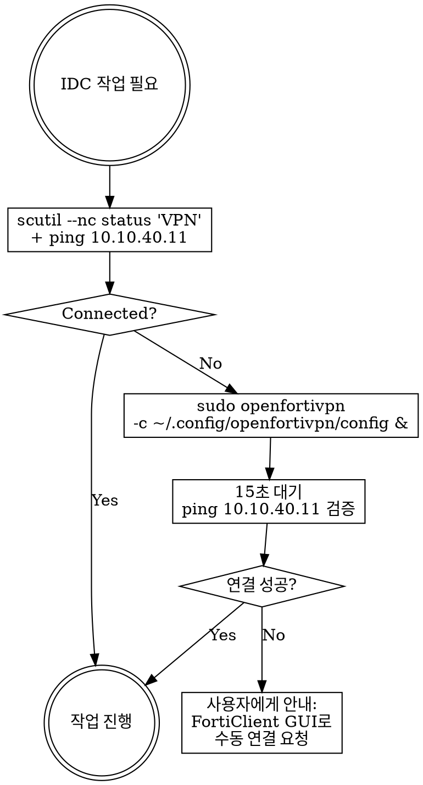

# VPN Manager

IDC 네트워크(10.10.x.x) 접근에 필요한 FortiGate SSL VPN 연결을 CLI로 관리한다.

## Prerequisites (1회성 설정)

```bash
# 1. openfortivpn 설치
brew install openfortivpn

# 2. 첫 연결로 서버 인증서 해시 획득
sudo openfortivpn 222.106.222.208:8443 -u <user> -p <pw>
# → 실패 시 출력되는 trusted-cert 해시 복사

# 3. config 파일 생성
mkdir -p ~/.config/openfortivpn
# ~/.config/openfortivpn/config:
#   host = 222.106.222.208
#   port = 8443
#   username = <user>
#   password = <password>
#   trusted-cert = <sha256_hash>
chmod 600 ~/.config/openfortivpn/config

# 4. (선택) sudo 없이 실행
# /etc/sudoers.d/openfortivpn:
#   %admin ALL=(ALL) NOPASSWD: /opt/homebrew/bin/openfortivpn
```

## Quick Reference

| 작업 | 명령어 |
|------|--------|
| **상태 확인** | `scutil --nc status "VPN"` |
| **연결 (openfortivpn)** | `echo '<sudo_pw>' \| sudo -S openfortivpn -c ~/.config/openfortivpn/config &` |
| **연결 검증** | `ping -c 1 -W 2 10.10.40.11` |
| **해제 (openfortivpn)** | `echo '<sudo_pw>' \| sudo -S kill $(pgrep openfortivpn)` |
| **해제 (FortiClient)** | `scutil --nc stop "VPN"` |
| **인터페이스 확인** | `ifconfig ppp0` 또는 `ifconfig utun8` |

## Workflow



### Step-by-Step

1. **상태 확인** (항상 먼저 실행)
   ```bash
   VPN_STATUS=$(scutil --nc status "VPN" 2>/dev/null | head -1)
   PING_OK=$(ping -c 1 -W 2 10.10.40.11 2>/dev/null && echo "yes" || echo "no")
   ```
   - `Connected` + ping 성공 → **바로 작업 진행**
   - 그 외 → 연결 시도

2. **sudo 비밀번호 조회** (Memory Graph에서 가져오기)
   ```
   mcp_memory_search_nodes(query="sudo password")
   → entity: MacBook-Sudo-Credentials → sudo password 획득
   ```
   - **중요**: 비대화형 환경(Claude Code)에서는 sudo가 터미널 입력을 받을 수 없음
   - 반드시 `echo '<pw>' | sudo -S` 패턴 사용

3. **자동 연결** (Safe — 자율 실행)
   ```bash
   echo '<sudo_pw>' | sudo -S openfortivpn -c ~/.config/openfortivpn/config > /tmp/vpn.log 2>&1 &
   sleep 8
   # 연결 검증 (최대 3회 재시도)
   for i in 1 2 3; do
     if ping -c 1 -W 2 10.10.40.11 2>/dev/null; then
       echo "VPN_CONNECTED"
       break
     fi
     echo "Retry $i..."
     sleep 3
   done
   ```

4. **연결 실패 시 폴백**
   ```
   VPN 자동 연결에 실패했습니다.
   FortiClient GUI에서 'gowid' 프로파일로 수동 연결해주세요.
   연결 후 다시 시도하겠습니다.
   ```

5. **해제** — 명시적 요청 시에만
   ```bash
   # openfortivpn으로 연결한 경우
   echo '<sudo_pw>' | sudo -S kill $(pgrep openfortivpn) 2>/dev/null
   # FortiClient로 연결된 경우
   scutil --nc stop "VPN"
   ```

## VPN 환경 상세

| 항목 | 값 |
|------|-----|
| VPN 서버 | 222.106.222.208:8443 |
| 프로토콜 | SSL VPN (FortiGate) |
| 프로파일명 | gowid (FortiClient) / config (openfortivpn) |
| 인증 방식 | ID/PW (2FA 없음) — 자격증명은 `~/.config/openfortivpn/config` 참조 |
| VPN IP 대역 | 10.212.12.x |
| 인터페이스 | utun (FortiClient) / ppp0 (openfortivpn) |
| DNS | 168.126.63.1, 8.8.8.8 |

### 라우팅 대상 (VPN 터널 경유)

| 네트워크 | 용도 |
|----------|------|
| 10.10.10.0/24 | DMZ Zone (LB) |
| 10.10.20.0/24 | API Zone (WAS, GW) |
| 10.10.30.0/24 | DB Zone (MySQL, MongoDB) |
| 10.10.40.0/24 | Dev Zone (controller) |
| 10.10.50.0/24 | Mgmt Zone (iDRAC) |
| 10.10.90.0/24 | Partner VPN Zone |
| 34.64.0.0/16 | GCP asia-northeast3 |
| 192.168.99.0/24 | 사내 네트워크 |

## Rules

- **위험 등급**: Safe — VPN 연결/해제/상태확인 모두 자율 실행
- **자동 해제 금지**: 작업 완료 후에도 VPN을 자동으로 끊지 않음 (사용자가 다른 작업 중일 수 있음)
- **기존 연결 존중**: FortiClient GUI로 이미 연결된 경우 재연결 시도하지 않음
- **자격증명**: config 파일(600 퍼미션) 또는 Memory Graph에만 저장. 코드/로그에 절대 노출 금지
- **로그**: `/tmp/vpn.log`에 연결 로그 저장 (디버깅용)

## Common Mistakes

| 실수 | 올바른 방법 |
|------|------------|
| FortiClient GUI + openfortivpn 동시 사용 | 하나만 사용. 충돌 발생 |
| VPN 연결 안 되었는데 SSH 시도 | 항상 상태확인 먼저 |
| config 파일에 trusted-cert 누락 | 첫 연결 시 출력되는 해시 반드시 추가 |
| openfortivpn을 sudo 없이 실행 | PPP 터널 생성에 root 필요 |
| 연결 후 바로 SSH 시도 | 8초 대기 + ping 검증 후 진행 |
| **non-interactive 환경에서 `sudo` 직접 실행** | **`echo '<pw>' \| sudo -S` 패턴 사용. Memory Graph에서 비밀번호 조회 (`query="sudo password"`)** |
